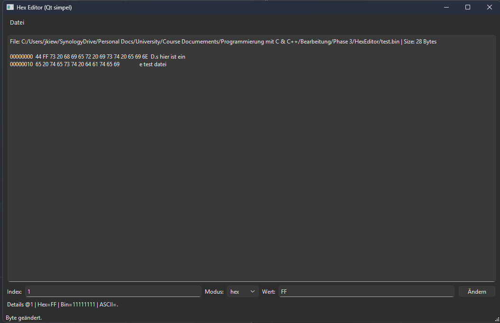

# HEX / BIN / ASCII DATEI-EDITOR – PHASE 3
-----------------------------------------

Dieses Projekt entstand im Rahmen des Kurses  
„Programmierung mit C/C++“.

Ziel der Anwendung ist ein einfacher Editor für Binärdateien,
der einzelne Bytes einer Datei anzeigen und verändern kann.

Der Dateiinhalt wird dabei in drei verschiedenen
Darstellungsformen visualisiert:

- Hexadezimal
- Binär
- ASCII

## ENTWICKLUNGSUMGEBUNG
-----------------------------------------

Das Projekt wurde entwickelt mit:

- Windows
- Qt 6 (Qt Widgets)
- MinGW Compiler
- CMake Build System

## FUNKTIONALITÄT
-----------------------------------------

Die Anwendung bietet folgende Funktionen:

- Öffnen von Binärdateien über einen Dateidialog
- Anzeige des Datei-Inhalts im Stil eines einfachen Hex-Editors
- Darstellung jedes Bytes in:
  - Hexadezimalform
  - Binärform
  - ASCII-Darstellung
- Bearbeiten einzelner Bytes über eine grafische Oberfläche
- Eingabe neuer Werte in:
  - Hexadezimalform
  - Binärform
  - ASCII-Form
- Anzeige der Details eines Bytes:
  - Hex
  - Binär
  - ASCII
- Speichern der Datei
- Speichern unter einem neuen Dateinamen

## BENUTZEROBERFLÄCHE
-----------------------------------------

Die grafische Benutzeroberfläche wurde mit **Qt Widgets**
implementiert.

Das Hauptfenster besteht aus:

- einer Hex-Editor Anzeige des Datei-Inhalts
- Eingabefeldern zur Bearbeitung einzelner Bytes
- einer Detailanzeige für das aktuell bearbeitete Byte
- einem Menü zum Öffnen und Speichern von Dateien

Die Darstellung erfolgt zeilenweise:

Adresse | Hex-Werte | ASCII-Darstellung

## Screenshot
-----------------------------------------

Das Diagramm zeigt die modulare Architektur der Anwendung.

Die grafische Oberfläche wird von der Klasse MainWindow gesteuert.
Für den Zugriff auf Dateien wird der FileManager verwendet.
Die Klasse Converter übernimmt die Umrechnung einzelner Bytes
in Hex-, Binär- und ASCII-Darstellungen.

## SOFTWAREARCHITEKTUR
-----------------------------------------

Die Anwendung ist modular aufgebaut und besteht aus drei
zentralen Komponenten:

MainWindow
GUI / Steuerung

↓

FileManager
Laden / Speichern von Dateien
Ändern einzelner Bytes

↓

Converter
Umrechnung einzelner Bytes in
Hex / Bin / ASCII Darstellung

### MainWindow
-----------------------------------------

Die Klasse `MainWindow` stellt die grafische Benutzeroberfläche
bereit und verbindet die Benutzerinteraktion mit der
Programmlogik.

Aufgaben:

- Aufbau der GUI
- Öffnen und Speichern von Dateien
- Bearbeiten einzelner Bytes
- Aktualisierung der Anzeige

### FileManager
-----------------------------------------

Die Klasse `FileManager` übernimmt den Zugriff auf
Binärdateien.

Aufgaben:

- Laden einer Datei in einen Byte-Puffer
- Speichern der Daten auf die Festplatte
- Ändern einzelner Bytes

### Converter
-----------------------------------------

Die Klasse `Converter` wandelt einzelne Bytes in verschiedene
Darstellungsformen um:

- Hexadezimal
- Binär
- ASCII

## PROJEKTSTRUKTUR
-----------------------------------------

src/
main.cpp
MainWindow.cpp
filemanager.cpp
converter.cpp

include/
MainWindow.h
filemanager.h
converter.h

docs/
screenshot.png

Weitere Dateien:
CMakeLists.txt
README.md
test.bin

## KOMPILIERUNG
-----------------------------------------

Voraussetzungen:

- Qt 6 (Qt Widgets)
- CMake
- MinGW oder kompatibler C++ Compiler

### Build

Im Projektordner:

cmake -S . -B build -DCMAKE_PREFIX_PATH="C:\Qt\6.x.x\mingw_64"
cmake --build build

## STARTEN
-----------------------------------------

build\HexEditorQt.exe

### Hinweis zu Qt Bibliotheken (Windows)

Beim manuellen Start der Anwendung können unter Windows
fehlende Qt Bibliotheken auftreten.

Diese können automatisch mit `windeployqt`
in den Build-Ordner kopiert werden:

C:\Qt\6.x.x\mingw_64\bin\windeployqt.exe build\HexEditorQt.exe

Danach kann das Programm normal gestartet werden:

build\HexEditorQt.exe

## ENTWICKLUNGSSTAND
-----------------------------------------

Diese Version entspricht **Phase 3** des Projekts.

In Phase 3 wurde die zuvor entwickelte Konsolenanwendung
(Phase 2) um eine grafische Benutzeroberfläche erweitert.

Der Fokus lag auf:

- Integration von Qt Widgets
- grafischer Darstellung der Binärdaten
- Benutzerinteraktion über eine GUI
- Bearbeitung einzelner Bytes innerhalb der Anwendung

## HINWEIS ZUR NUTZUNG VON KI-WERKZEUGEN
-----------------------------------------

KI-basierte Werkzeuge wurden unterstützend verwendet
für:

- Analyse von Compilerfehlern
- Unterstützung bei der Strukturierung des Codes
- sprachliche Verbesserung der Dokumentation

Die Konzeption der Softwarearchitektur,
die Implementierung der Funktionen sowie
das Testen der Anwendung erfolgten eigenständig.