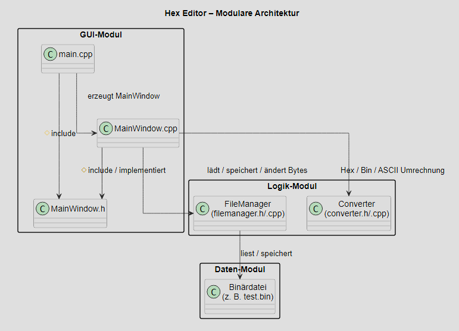

# HEX / BIN / ASCII DATEI-EDITOR – PHASE 3
-----------------------------------------

Dieses Projekt entstand im Rahmen des Kurses  
„Programmierung mit C/C++“.

Ziel der Anwendung ist ein einfacher Editor für Binärdateien,
der einzelne Bytes einer Datei anzeigen und verändern kann.

Der Dateiinhalt wird dabei in drei verschiedenen
Darstellungsformen visualisiert:

- Hexadezimal
- Binär
- ASCII

## ENTWICKLUNGSUMGEBUNG
-----------------------------------------

Das Projekt wurde entwickelt mit:

- Windows
- Qt 6 (Qt Widgets)
- MinGW Compiler
- CMake Build System

## FUNKTIONALITÄT
-----------------------------------------

Die Anwendung bietet folgende Funktionen:

- Öffnen von Binärdateien über einen Dateidialog
- Anzeige des Datei-Inhalts im Stil eines einfachen Hex-Editors
- Darstellung jedes Bytes in:
  - Hexadezimalform
  - Binärform
  - ASCII-Darstellung
- Bearbeiten einzelner Bytes über eine grafische Oberfläche
- Eingabe neuer Werte in:
  - Hexadezimalform
  - Binärform
  - ASCII-Form
- Anzeige der Details eines Bytes:
  - Hex
  - Binär
  - ASCII
- Speichern der Datei
- Speichern unter einem neuen Dateinamen
- Hilfe-Menü mit kurzer Bedienungsanleitung

## BENUTZEROBERFLÄCHE
-----------------------------------------

Die grafische Benutzeroberfläche wurde mit **Qt Widgets**
implementiert.

Das Hauptfenster besteht aus:

- einer Hex-Editor Anzeige des Datei-Inhalts
- Eingabefeldern zur Bearbeitung einzelner Bytes
- einer Detailanzeige für das aktuell bearbeitete Byte
- einem Menü zum Öffnen und Speichern von Dateien
- einem Hilfe-Menü zur Erklärung der Benutzung

Die Darstellung erfolgt zeilenweise:

Adresse | Hex-Werte | ASCII-Darstellung

## SCREENSHOT
-----------------------------------------

## SOFTWAREARCHITEKTUR
-----------------------------------------

Die Anwendung ist modular aufgebaut und besteht aus drei
zentralen Bereichen:

- GUI-Modul
- Logik-Modul
- Daten-Modul

## ARCHITEKTURDIAGRAMM
-----------------------------------------

Das Diagramm zeigt die modulare Architektur der Anwendung mit den
wichtigsten Dateien und ihren Abhängigkeiten.

Das **GUI-Modul** besteht aus `main.cpp`, `MainWindow.h` und
`MainWindow.cpp`.

- `main.cpp` bildet den Einstiegspunkt des Programms,
  initialisiert die Qt-Anwendung und erzeugt das Hauptfenster.
- `MainWindow.h` enthält die Klassendeklaration des Hauptfensters.
- `MainWindow.cpp` implementiert die grafische Oberfläche,
  die Menüs sowie die Benutzerinteraktion.

Das **Logik-Modul** besteht aus `filemanager.h/.cpp` und
`converter.h/.cpp`.

- Der `FileManager` übernimmt das Laden und Speichern von Dateien
  sowie das Ändern einzelner Bytes im internen Datenpuffer.
- Der `Converter` wandelt einzelne Byte-Werte in Hex-, Binär-
  und ASCII-Darstellungen um.

Das **Daten-Modul** besteht aus der eigentlichen Binärdatei,
zum Beispiel `test.bin`.

Die Pfeile im Diagramm zeigen gerichtete Abhängigkeiten:

- `main.cpp` greift auf `MainWindow` zu, um die Anwendung zu starten.
- `MainWindow.cpp` verwendet den `FileManager`, um Dateien zu laden,
  zu speichern und Byte-Werte zu ändern.
- `MainWindow.cpp` verwendet den `Converter`, um Byte-Werte für die
  Anzeige in Hex-, Binär- und ASCII-Form umzuwandeln.
- Der `FileManager` greift direkt auf die Binärdatei zu, um Daten
  zu lesen oder zu speichern.

Die Datei selbst enthält keine Logik und kennt die anderen Module
nicht. Daher zeigt die Abhängigkeit nur vom `FileManager`
zur Binärdatei und nicht in beide Richtungen.

### MainWindow
-----------------------------------------

Die Klasse `MainWindow` stellt die grafische Benutzeroberfläche
bereit und verbindet die Benutzerinteraktion mit der
Programmlogik.

Aufgaben:

- Aufbau der GUI
- Öffnen und Speichern von Dateien
- Bearbeiten einzelner Bytes
- Aktualisierung der Anzeige
- Bereitstellung eines Hilfe-Menüs

### FileManager
-----------------------------------------

Die Klasse `FileManager` übernimmt den Zugriff auf
Binärdateien.

Aufgaben:

- Laden einer Datei in einen Byte-Puffer
- Speichern der Daten auf die Festplatte
- Ändern einzelner Bytes

### Converter
-----------------------------------------

Die Klasse `Converter` wandelt einzelne Bytes in verschiedene
Darstellungsformen um:

- Hexadezimal
- Binär
- ASCII

## ERKLÄRUNG DER WICHTIGSTEN METHODEN
-----------------------------------------

Die zentrale Steuerung der Anwendung erfolgt über die Klasse
`MainWindow`. Sie verbindet die grafische Benutzeroberfläche
mit der Programmlogik und ruft die entsprechenden Funktionen
des `FileManager` und des `Converter` auf.

Die Methode `openFile()` wird über das Menü „Datei → Öffnen“
ausgelöst. Sie öffnet einen Dateidialog, über den der Benutzer
eine Binärdatei auswählen kann. Anschließend wird die Datei
über den `FileManager` geladen. Nach erfolgreichem Laden
ruft die Methode `rebuildView()` auf, um den Inhalt der Datei
im Hex-Editor darzustellen.

Die Methode `saveFile()` speichert die aktuell geladene Datei
unter dem bestehenden Pfad. Falls noch kein Dateipfad vorhanden
ist, wird über `ensurePathForSave()` automatisch ein
„Speichern unter“-Dialog geöffnet. Die eigentliche Speicherung
erfolgt durch den `FileManager`.

Die Methode `saveFileAs()` erlaubt das Speichern der Datei unter
einem neuen Dateinamen. Dadurch kann eine bearbeitete Datei
gespeichert werden, ohne die Originaldatei zu überschreiben.

Die Methode `applyChange()` implementiert die zentrale
Bearbeitungsfunktion des Editors. Sie liest zunächst den vom
Benutzer eingegebenen Index aus und prüft, ob dieser innerhalb
der Dateigröße liegt. Anschließend wird der eingegebene Wert
abhängig vom gewählten Modus (hex, bin oder ascii) mit Hilfe
der Methode `parseByteValueQt()` in ein Byte umgewandelt.
Danach wird das entsprechende Byte im internen Puffer des
`FileManager` geändert. Zum Abschluss wird die Anzeige über
`rebuildView()` aktualisiert und die Detailinformationen über
`updateDetails()` neu berechnet.

Die Methode `parseByteValueQt()` übernimmt die Interpretation
der Benutzereingabe. Sie prüft, in welchem Format der Benutzer
den Wert eingegeben hat, und wandelt diesen in einen
`uint8_t`-Wert um. Unterstützt werden hexadezimale Eingaben,
binäre Eingaben mit acht Bits sowie einzelne ASCII-Zeichen.

Die Methode `rebuildView()` baut die komplette Anzeige des
Hex-Editors neu auf. Sie iteriert über den internen Byte-Puffer
und formatiert die Daten zeilenweise. Pro Zeile werden die
Adresse, die Hex-Werte sowie die ASCII-Darstellung ausgegeben.

Die Methode `updateDetails()` zeigt zusätzliche Informationen
zu einem einzelnen Byte an. Nach einer Änderung oder Auswahl
eines Index werden der Hex-Wert, die Binärdarstellung sowie
das ASCII-Zeichen berechnet und im Detailbereich der
Benutzeroberfläche angezeigt.

Zusammen bilden diese Methoden den zentralen Ablauf der
Anwendung. Die GUI nimmt Eingaben entgegen, ruft die
Logikfunktionen auf und aktualisiert anschließend die
Darstellung. Dadurch bleibt die Verantwortung klar getrennt
und die Architektur der Anwendung übersichtlich.

## PROJEKTSTRUKTUR
-----------------------------------------

src/
  main.cpp
  MainWindow.cpp
  filemanager.cpp
  converter.cpp

include/
  MainWindow.h
  filemanager.h
  converter.h

docs/
  screenshot.png
  architecture.png

Weitere Dateien:
  CMakeLists.txt
  README.md
  test.bin

## KOMPILIERUNG
-----------------------------------------

Voraussetzungen:

- Qt 6 (Qt Widgets)
- CMake
- MinGW oder kompatibler C++ Compiler

### Build

Im Projektordner:

cmake -S . -B build -DCMAKE_PREFIX_PATH="C:\Qt\6.x.x\mingw_64"
cmake --build build

## STARTEN
-----------------------------------------

build\HexEditorQt.exe

### Hinweis zu Qt Bibliotheken (Windows)

Beim manuellen Start der Anwendung können unter Windows
fehlende Qt Bibliotheken auftreten.

Diese können automatisch mit `windeployqt`
in den Build-Ordner kopiert werden:

C:\Qt\6.x.x\mingw_64\bin\windeployqt.exe build\HexEditorQt.exe

Danach kann das Programm normal gestartet werden:

build\HexEditorQt.exe

## BENUTZUNG
-----------------------------------------

1. Öffnen Sie eine Binärdatei über `Datei -> Öffnen`.
2. Der Dateiinhalt wird im Editor angezeigt.
3. Geben Sie einen Index ein.
4. Wählen Sie den Modus `hex`, `bin` oder `ascii`.
5. Geben Sie einen neuen Wert ein.
6. Klicken Sie auf `Ändern`, um das Byte zu bearbeiten.
7. Speichern Sie die Datei über `Datei -> Speichern`
   oder `Datei -> Speichern unter`.

### Bedeutung des Index

Der Index gibt die Position eines Bytes in der Datei an.

- Das erste Byte hat den Index `0`
- Das zweite Byte hat den Index `1`
- Das elfte Byte hat den Index `10`

Der Benutzer kann dadurch gezielt ein einzelnes Byte an
einer bestimmten Position auswählen und verändern.

### Beispiele für Werte

- `hex`   : `FF`
- `bin`   : `01000001`
- `ascii` : `Z`

## ENTWICKLUNGSSTAND
-----------------------------------------

Diese Version entspricht **Phase 3** des Projekts.

In Phase 3 wurde die zuvor entwickelte Konsolenanwendung
(Phase 2) um eine grafische Benutzeroberfläche erweitert.

Der Fokus lag auf:

- Integration von Qt Widgets
- grafischer Darstellung der Binärdaten
- Benutzerinteraktion über eine GUI
- Bearbeitung einzelner Bytes innerhalb der Anwendung
- Verbesserung der Dokumentation und Softwarestruktur

## HINWEIS ZUR NUTZUNG VON KI-WERKZEUGEN
-----------------------------------------

KI-basierte Werkzeuge wurden unterstützend verwendet für:

- Analyse von Compilerfehlern
- Unterstützung bei der Strukturierung des Codes
- sprachliche Verbesserung der Dokumentation
- Erstellung und Überarbeitung von Architekturdiagrammen

Die Konzeption der Softwarearchitektur,
die Implementierung der Funktionen sowie
das Testen der Anwendung erfolgten eigenständig.